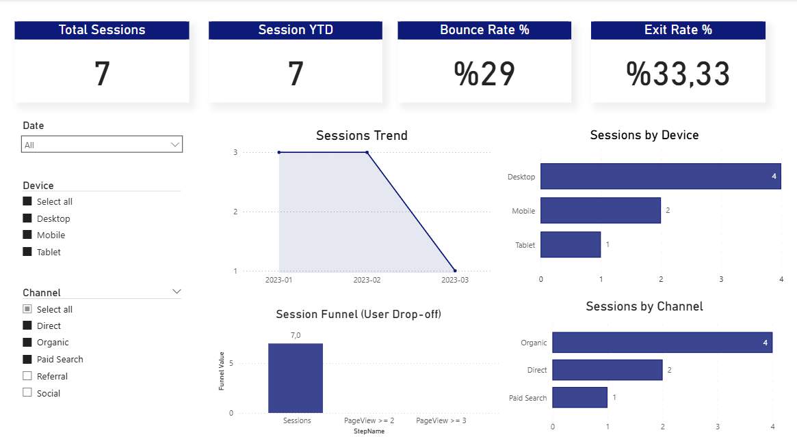

## Project Overview

End-to-end web analytics project built with Power BI and SQL.
The project covers data modeling, metric definitions (bounce, exit, funnel),
and interactive dashboards for business insights.

# Web Analytics Dashboard – Power BI

## Project Overview
This project analyzes website user behavior using session-level data.
The dashboard focuses on traffic trends, user drop-off funnel, bounce rate,
exit rate, and channel/device performance.

## Data Model
- FactSessions
- FactPageViews
- DimDate
- DimDevice
- DimChannel

Star schema was used for performance and clarity.

## Key Metrics
- Total Sessions
- Sessions YTD
- Bounce Rate
- Exit Rate
- Session Funnel (PageView ≥ 2, PageView ≥ 3)

## Tools & Skills
- Power BI
- DAX
- Data Modeling (Star Schema)
- Web Analytics Concepts

## Dashboard Preview 

